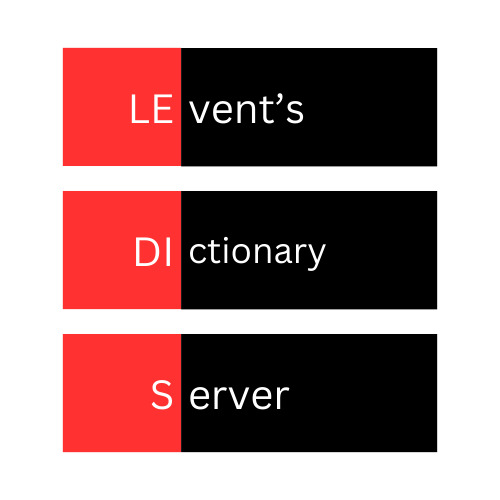

# Ledis
- WIP -

  

Ledis or *Le*vent's *DI*ctionary *S*erver is a minor re-creation of Redis, which works as a in-memory caching server that created out of boredom. Ledis utilize the foundational functions of caching in memory. I just created this piece of software to have depper understanding on redis and experimenting on user-level networking with data structures used in cahing such as hash tables and AVL Trees.

I hate to say this word but I created Ledis to be _scaleable_ as much as possible. That means you can take the Ledis even change the protocol type and integrate to your project. Even tho it's not suitable for production i think it's a nice tool for minor projects and experimenting on behaviour of caching.

## License
Ledis is under [MIT](./LICENSE) license.
